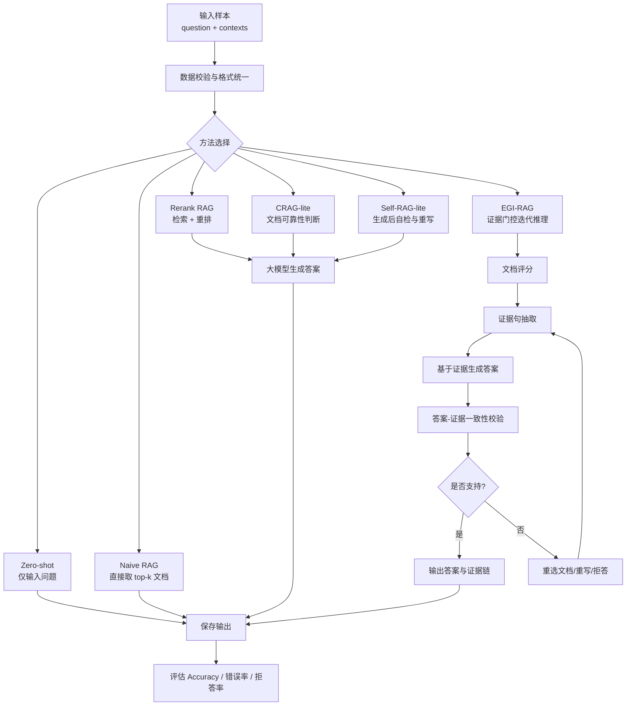

# 面向噪声文档的鲁棒 RAG 推理方法研究与实现

## 摘要

检索增强生成（Retrieval-Augmented Generation, RAG）通过将外部文档引入大语言模型问答流程，能够缓解模型知识过时和幻觉问题。然而，在真实检索场景中，候选文档往往包含大量无关噪声、误导信息和冲突内容。若直接将候选文档拼接给大模型，模型容易被错误文档诱导，或在正确文档排名靠后时无法生成正确答案。本文围绕“面向大模型 RAG 推理场景噪音文档的鲁棒性推理方法”展开，构建了包含 RGB、RAMDocs 和 Conflicts 的噪声问答实验数据，并实现了 Zero-shot、Naive RAG、Rerank RAG、CRAG-lite、Self-RAG-lite 以及 EGI-RAG 等方法。EGI-RAG（Evidence-Gated Iterative RAG）在生成答案前进行文档评分与证据抽取，在生成后进行证据一致性校验，并在必要时迭代修正。实验结果表明，相比 Zero-shot 和 Naive RAG，引入检索重排和证据校验机制能够明显提升噪声场景下的问答准确率；在 RGB 全量数据上，Rerank RAG 和 Self-RAG-lite 均达到 68.0% 的准确率，明显高于 Naive RAG 的 61.7% 和 Zero-shot 的 9.0%。本文最后讨论了现有方法在多跳推理、冲突证据处理、中文编码和评估指标上的局限，并给出后续改进方向。

**关键词**：检索增强生成；噪声文档；RAG；大语言模型；证据抽取；鲁棒问答

## 1. 课题背景

### 1.1 研究背景

大语言模型在开放域问答、知识推理和文本生成任务中表现出较强能力，但单纯依赖模型内部参数知识存在三个问题。第一，模型知识可能滞后，无法覆盖最新事实。第二，模型在缺乏证据约束时容易产生幻觉，即生成看似合理但不可靠的答案。第三，在专业问答或长文档问答中，用户往往要求答案必须来自给定资料，而不仅是模型的通用知识。

RAG 方法通过“检索外部文档 + 大模型生成答案”的方式缓解上述问题。典型 RAG 流程先根据问题检索若干相关文档，再将文档和问题一起输入大语言模型，由模型基于文档作答。但在真实检索系统中，检索结果并不总是干净的。候选文档中可能包含：

- 与问题无关但词面相似的噪声文档；
- 与问题相关但事实错误的误导文档；
- 与正确证据相互冲突的文档；
- 排名靠前但证据不完整的弱相关文档。

如果 RAG 系统不能识别这些干扰信息，模型可能会引用错误证据、产生错误答案，甚至在正确文档存在时仍然拒答。因此，本课题关注的问题是：如何在噪声文档存在的情况下，提高 RAG 问答系统的鲁棒性和证据一致性。

### 1.2 课题目标

本课题目标包括以下四点：

1. 构建统一格式的噪声文档问答数据，覆盖 RGB、RAMDocs 和 Conflicts 等不同噪声类型。
2. 实现基础 RAG 方法和若干鲁棒 RAG 方法，形成可对比的实验框架。
3. 在噪声比例和正确文档位置可控的实验设置下，分析不同方法的抗噪能力。
4. 设计并实现 EGI-RAG 方法，通过文档评分、证据抽取、答案校验和迭代修正提升答案可靠性。

### 1.3 成果应用价值

本课题的成果可用于企业知识库问答、教学资料问答、法律/医疗/科研文档辅助阅读等场景。在这些场景中，系统不仅要回答问题，还需要保证答案来自可靠证据。本文实现的文档评分、证据抽取与一致性校验流程，可以降低噪声文档对答案的干扰，并为后续构建可解释 RAG 系统提供基础。

## 2. 方法主要框架

本文实现的系统由数据处理、检索重排、答案生成、证据校验和实验评估五个部分组成。整体流程如图 1 所示。



图 1 展示了系统中各方法的逻辑关系。Zero-shot 不使用文档，主要作为大模型自身知识能力的基线。Naive RAG 直接使用候选文档前若干篇，能够体现最朴素 RAG 的效果。Rerank RAG 在候选文档中进行检索与重排，提高正确文档被选中的概率。CRAG-lite 和 Self-RAG-lite 分别从“文档可靠性判断”和“生成后自检”两个方向增强鲁棒性。EGI-RAG 则将文档评分、证据抽取和一致性校验整合成一个迭代流程，强调答案必须由明确证据支撑。

## 3. 方法主要技术

### 3.1 数据统一与样本结构

所有实验样本统一为 JSON 数组。每个样本包含问题、候选文档和可选答案字段。模型运行时主要读取 `*_input.json`，评估时读取 `*_reference.json`，分析时使用 `*_full.json`。

```json
{
  "id": "rgb_0000",
  "dataset": "RGB",
  "question": "Who is the runner-up in the women's singles at the 2023 French Open?",
  "contexts": [
    {
      "doc_id": "doc_1",
      "title": "",
      "text": "候选文档正文",
      "label": "correct/noise/misinfo/unknown"
    }
  ],
  "gold_answers": ["Karolina Muchova"],
  "wrong_answers": [],
  "_meta": {
    "n_positive": 5,
    "n_negative": 26
  }
}
```

其中，`contexts` 是 RAG 方法的核心输入。`label` 表示文档类型：`correct` 表示支持答案，`noise` 表示无关噪声，`misinfo` 表示误导文档，`unknown` 表示未标注或冲突类文档。

### 3.2 大模型调用封装

项目通过 `src/llm/qwen_client.py` 封装 Qwen/百炼兼容接口。配置文件位于 `configs/model_config.example.yaml`：

```yaml
provider: qwen
api_key: ""
model: "qwen3.5-flash"
base_url: "https://dashscope.aliyuncs.com/compatible-mode/v1/chat/completions"
max_tokens: 256
enable_thinking: false
```

API Key 优先从环境变量 `DASHSCOPE_API_KEY` 中读取，模型名可通过 `DASHSCOPE_MODEL` 覆盖。调用时将系统提示词和用户提示词组织为 Chat Completions 格式，并设置 `temperature=0.2` 以降低生成随机性。

### 3.3 检索与重排技术

Rerank RAG 使用两阶段流程：

1. **检索阶段**：优先使用 `BAAI/bge-m3` 编码问题和文档，并用 FAISS 计算内积相似度，选出 top-k 候选文档。
2. **重排阶段**：优先使用 `BAAI/bge-reranker-v2-m3` 对问题-文档对进行打分，选出 top-n 文档。

如果本地缺少模型或依赖，系统会自动回退到词面打分。词面打分由 `src/rag_baselines/rerank.py` 实现，主要基于问题词与文档词的重叠率、密度和长度惩罚：

```python
coverage = len(overlap) / max(len(query_set), 1)
density = sum(1 for token in doc_tokens if token in query_set) / max(len(doc_tokens), 1)
length_penalty = 1.0 / math.sqrt(max(len(doc_tokens), 1))
score = coverage + density + length_penalty
```

该回退机制保证了即使没有神经检索环境，也能进行小规模验证和流程演示。

### 3.4 基线方法

本文实现了五种基础或增强基线：

| 方法 | 核心逻辑 | 优点 | 局限 |
|---|---|---|---|
| Zero-shot | 只输入问题，不输入文档 | 检查模型自身知识 | 无法保证答案来自证据 |
| Naive RAG | 直接取前 top-k 文档 | 简单、成本低 | 正确文档靠后时效果差 |
| Rerank RAG | 检索后重排再生成 | 提高正确文档命中率 | 仍可能被误导文档影响 |
| CRAG-lite | 先判断文档可靠性再生成 | 能过滤部分噪声文档 | 判断依赖 LLM，可能误判 |
| Self-RAG-lite | 生成后自检，不支持则重写或拒答 | 能降低无证据答案 | 多次调用成本较高 |

这些方法统一由 `src/run_baseline.py` 调用，核心逻辑在 `src/rag_baselines/baselines.py` 中。

### 3.5 EGI-RAG 方法

EGI-RAG 是本文重点实现的增强方法。其核心思想是：在答案生成之前，不仅要选择文档，还要抽取明确证据；在答案生成之后，还要验证答案是否被证据支持。

EGI-RAG 包含以下模块：

1. **Local Rerank**：先从候选文档中选出 top-n 文档，减少后续 LLM 处理成本。
2. **Document Scorer**：判断文档类型，并输出可信分数。标签包括 `directly_supportive`、`partially_relevant`、`irrelevant`、`contradictory`、`misleading`、`insufficient`。
3. **Evidence Extractor**：从高分文档中抽取直接支持答案的原文证据句。
4. **Answer Generator**：只基于证据句生成最终答案。
5. **Verifier**：判断答案是否被证据支持，输出 `supported`、`unsupported`、`conflict` 或 `insufficient_evidence`。
6. **Corrector**：如果答案不被支持，则重选文档、重写答案或拒答。

EGI-RAG 的主流程位于 `src/egi_rag/pipeline.py`，运行入口为 `src/run_egi_rag.py`。其输出不仅包含答案，还包含文档评分、证据句、校验结果和迭代日志，便于后续解释和案例分析。

### 3.6 关键提示词设计

EGI-RAG 的提示词位于 `src/egi_rag/prompts.py`。核心约束是要求模型输出结构化 JSON，减少后处理难度。例如文档评分提示词要求输出：

```json
[
  {
    "doc_id": "doc_1",
    "label": "directly_supportive",
    "score": 0.92,
    "reason": "简短理由"
  }
]
```

证据校验提示词要求输出：

```json
{
  "verification_result": "supported",
  "reason": "简短理由",
  "unsupported_claims": []
}
```

这类结构化输出便于程序解析，并使实验结果更容易分析。

## 4. 实验情况

### 4.1 实验数据集

实验使用三个数据集：

| 数据集 | 小样本数 | 全量样本数 | 文档特点 |
|---|---:|---:|---|
| RGB | 30 | 300 | 正确文档比例较低，噪声文档多 |
| RAMDocs | 20 | 500 | 包含 correct、noise、misinfo 文档 |
| Conflicts | 20 | 458 | 侧重冲突信息，部分样本无标准答案 |

此外，项目构造了可控噪声数据集，位于 `samples/controlled/`。文件名中的 `noise020`、`noise040` 等表示噪声文档占比，`front`、`middle`、`back`、`random` 表示正确文档所在位置。该设计用于研究噪声比例和正确证据位置对 RAG 性能的影响。

### 4.2 数据获取与处理方式

项目中的数据处理脚本位于 `scripts/`：

- `step1_download_rgb.py`：下载或准备 RGB 数据。
- `step2_download_others.py`：下载或准备其他数据集。
- `step3_convert_and_sample.py`：统一转换格式并抽样。
- `step4_validate_schema.py`：校验 JSON schema。

处理后的主要数据位于 `samples/`：

- `*_input.json`：模型输入；
- `*_reference.json`：评估参考答案；
- `*_full.json`：包含输入、答案和元信息的完整样本。

### 4.3 实验设置

模型调用配置如下：

| 项目 | 设置 |
|---|---|
| 模型平台 | Qwen/百炼兼容 Chat Completions API |
| 默认模型 | `qwen3.5-flash` |
| 默认接口 | `https://dashscope.aliyuncs.com/compatible-mode/v1/chat/completions` |
| 最大输出长度 | 256 tokens |
| 思考模式 | `enable_thinking=false` |
| 检索模型 | `BAAI/bge-m3`，不可用时回退到词面检索 |
| 重排模型 | `BAAI/bge-reranker-v2-m3`，不可用时回退到词面重排 |

典型运行命令如下：

```powershell
python -m src.run_baseline --method naive_rag `
  --input samples/rgb_input.json `
  --output outputs/midterm/rgb_naive_rag_output.json `
  --limit 30 --top_k 5

python -m src.run_baseline --method rerank_rag `
  --input samples/rgb_input.json `
  --output outputs/midterm/rgb_rerank_rag_output.json `
  --limit 30 --top_k 20 --top_n 5

python -m src.run_egi_rag `
  --input samples/rgb_input.json `
  --output outputs/midterm/rgb_egi_rag_output.json `
  --limit 30 --top_k 8 --top_n 5
```

### 4.4 评估指标

本文采用简化准确率作为主要指标。若模型答案和 `gold_answers` 中任一标准答案存在包含关系，则判为正确：

```text
Accuracy = 正确样本数 / 有效样本数
```

同时统计错误数、拒答数和 API 错误数。需要注意的是，Conflicts 数据集中存在部分无标准答案样本，因此其 Accuracy 仅作辅助参考，更适合用于案例分析。

## 5. 实验结果和结论

### 5.1 中期小样本实验结果

| 数据集 | 方法 | 有效样本数 | 正确数 | Accuracy | API 错误 |
|---|---|---:|---:|---:|---:|
| RGB | Zero-shot | 30 | 3 | 10.0% | 0 |
| RGB | Naive RAG | 30 | 16 | 53.3% | 0 |
| RGB | Rerank RAG | 30 | 18 | 60.0% | 0 |
| RAMDocs | Zero-shot | 20 | 2 | 10.0% | 0 |
| RAMDocs | Naive RAG | 20 | 11 | 55.0% | 0 |
| RAMDocs | Rerank RAG | 20 | 13 | 65.0% | 0 |
| Conflicts | Zero-shot | 20 | 2 | 10.0% | 0 |
| Conflicts | Naive RAG | 20 | 2 | 10.0% | 0 |
| Conflicts | Rerank RAG | 19 | 5 | 26.3% | 1 |

从表中可以看出，在 RGB 和 RAMDocs 小样本上，RAG 方法明显优于 Zero-shot，说明外部文档对回答问题有重要作用。Rerank RAG 相比 Naive RAG 进一步提升，说明文档排序对噪声场景下的答案质量有明显影响。Conflicts 数据集由于存在冲突信息和部分无标准答案样本，整体准确率较低，更适合作为鲁棒性和冲突处理案例分析数据。

### 5.2 全量实验结果

| 数据集 | 方法 | 有效样本数 | 正确数 | Accuracy |
|---|---|---:|---:|---:|
| RGB | Zero-shot | 300 | 27 | 9.0% |
| RGB | Naive RAG | 300 | 185 | 61.7% |
| RGB | Rerank RAG | 300 | 204 | 68.0% |
| RGB | CRAG-lite | 300 | 200 | 66.7% |
| RGB | Self-RAG-lite | 300 | 204 | 68.0% |
| RAMDocs | Zero-shot | 500 | 37 | 7.4% |
| RAMDocs | Naive RAG | 500 | 323 | 64.6% |
| RAMDocs | Rerank RAG | 500 | 330 | 66.0% |
| RAMDocs | CRAG-lite | 500 | 295 | 59.0% |
| RAMDocs | Self-RAG-lite | 500 | 200 | 40.0% |

全量结果进一步说明：第一，Zero-shot 在噪声问答数据上效果很弱，说明模型自身知识无法替代文档证据。第二，Naive RAG 已能显著提升准确率，但仍受文档顺序影响。第三，Rerank RAG 在 RGB 和 RAMDocs 上均取得较稳定提升，说明重排是基础但有效的抗噪手段。第四，CRAG-lite 和 Self-RAG-lite 并非在所有数据集上都优于 Rerank RAG，原因可能是文档可靠性判断和自检提示词仍存在误判，尤其在 RAMDocs 的误导文档场景中，过强的自检可能导致答案被错误拒绝或重写。

### 5.3 EGI-RAG 的分析

EGI-RAG 的主要优势在于输出可解释。每条结果包含：

- `doc_scores`：每篇文档的相关性和可信度判断；
- `evidence_spans`：被抽取出来支持答案的证据句；
- `verification_result`：答案是否被证据支持；
- `iteration_log`：重选文档或修正答案的过程。

这使得 EGI-RAG 不仅关注答案是否正确，还关注“答案为什么可信”。在噪声文档较多的 RGB 场景中，EGI-RAG 能够通过文档评分和证据抽取减少对无关文档的依赖。与普通 RAG 相比，它更适合需要可解释性和证据链的应用场景。

### 5.4 结论

本文实验可以得到以下结论：

1. 噪声文档会显著影响 RAG 系统性能，直接取前 top-k 文档并不可靠。
2. 检索与重排是提升鲁棒性的关键步骤，在 RGB 和 RAMDocs 数据上均带来稳定提升。
3. 仅靠生成后自检并不总是有效，模型可能误判自己的答案或过度拒答。
4. EGI-RAG 通过“文档评分-证据抽取-答案生成-一致性校验-迭代修正”的流程，提高了结果可解释性和证据约束能力。
5. 对于高风险问答场景，答案应尽量绑定证据句，而不是只输出自然语言答案。

## 6. 方法局限性讨论

### 6.1 评估指标较简单

当前准确率采用字符串包含匹配，无法充分处理同义表达、中文英文别名、日期格式变化和多实体答案。部分模型答案事实上正确，但因为表达形式不同可能被判错；也可能出现答案字符串匹配但证据不充分的情况。

### 6.2 Conflicts 数据集标准答案不足

Conflicts 数据集中大量文档标签为 `unknown`，部分样本缺少标准答案。因此，Conflicts 更适合用于观察模型如何处理冲突证据，而不适合直接用 Accuracy 做严格比较。

### 6.3 大模型判断存在不稳定性

CRAG-lite、Self-RAG-lite 和 EGI-RAG 都依赖大模型进行文档判断或答案校验。若模型本身对证据理解不准确，就可能误判文档可靠性，导致正确证据被过滤，或错误证据被接受。

### 6.4 调用成本较高

EGI-RAG 每个样本通常需要多次模型调用，包括文档评分、证据抽取、答案生成、答案校验和修正策略生成。相比 Naive RAG 或 Rerank RAG，它的时间成本和 API 成本更高。

### 6.5 多跳推理能力仍有限

当前证据抽取更偏向单句证据。如果问题需要跨多个文档、多条证据进行组合推理，系统仍可能遗漏关键关系。后续可以加入多跳证据图、实体对齐和跨文档一致性检查。

### 6.6 噪声类型区分还不够细

当前主要区分 `correct`、`noise`、`misinfo` 和 `unknown`。但真实场景中的噪声可能包括时间过期、主体相似、局部事实错误、引用错误、观点冲突等更细类型。若能进一步细分噪声类型，可以更精准地分析方法失效原因。

## 7. 总结与展望

本文围绕噪声文档场景下的 RAG 鲁棒性问题，完成了数据整理、方法实现、实验运行和结果分析。实验表明，RAG 相比 Zero-shot 有显著优势，而检索重排可以进一步缓解噪声文档干扰。EGI-RAG 在此基础上引入证据门控和迭代校验机制，使答案生成过程更加可解释，也更适合需要证据约束的问答任务。

后续工作可以从三个方向继续改进。第一，完善评估脚本，引入 Exact Match、F1、答案归一化、拒答率、误导答案采纳率等指标。第二，在可控噪声数据上系统比较不同噪声比例和正确文档位置对方法性能的影响。第三，优化 EGI-RAG 的调用成本，例如将文档评分与证据抽取合并，或使用小模型进行前置过滤，从而在保持鲁棒性的同时提升效率。

## 参考文件与代码位置

- 数据目录：`samples/`
- 可控噪声数据：`samples/controlled/`
- 基线入口：`src/run_baseline.py`
- 基线方法：`src/rag_baselines/baselines.py`
- 检索模块：`src/rag_baselines/retriever.py`
- 重排模块：`src/rag_baselines/reranker.py`
- EGI-RAG 入口：`src/run_egi_rag.py`
- EGI-RAG 流程：`src/egi_rag/pipeline.py`
- EGI-RAG 提示词：`src/egi_rag/prompts.py`
- 模型配置：`configs/model_config.example.yaml`
- 合并整理说明：`PROJECT_SUMMARY.md`
