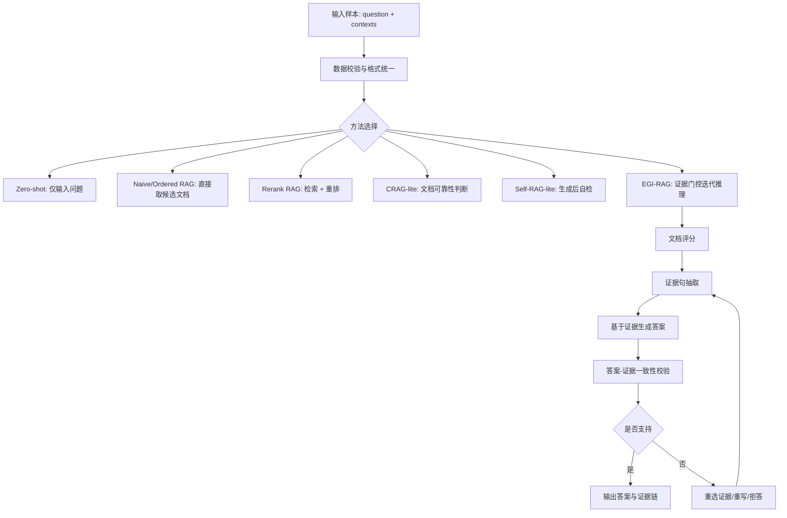

# 面向噪声文档的鲁棒 RAG 推理方法研究与实现

## 摘要

检索增强生成（Retrieval-Augmented Generation, RAG）通过将外部文档引入大语言模型问答流程，能够缓解模型知识过时和幻觉问题。然而，在真实检索场景中，候选文档常包含无关噪声、误导信息和冲突内容，模型若直接读取候选文档，容易被错误文档诱导。本文围绕“面向大模型 RAG 推理场景噪音文档的鲁棒性推理方法”展开，构建并整理 RGB、RAMDocs、Conflicts、可控噪声集和自定义噪声集，实现 Zero-shot、Ordered RAG、Naive RAG、Rerank RAG、CRAG-lite、Self-RAG-lite 与 EGI-RAG 等方法。EGI-RAG（Evidence-Gated Iterative RAG）在生成答案前进行文档评分与证据抽取，在生成后进行证据一致性校验，并在必要时拒答或迭代修正。最新实验修正了 prompt 中的标签泄漏问题，即模型输入只保留 `doc_id`、`title`、`text`，不再暴露 `label`。结果显示，EGI-RAG 在 RGB 全量数据上达到 0.9200 Accuracy、0.9933 Evidence Rate 和 0.9667 Refusal Rate；在自定义噪声数据上达到 0.7833 Accuracy，误导答案采纳率仅 0.0167。实验也显示，在 RAMDocs 和极端噪声场景中，强证据门控会带来较高拒答率，说明鲁棒性与覆盖率之间存在权衡。

**关键词**：检索增强生成；噪声文档；RAG；大语言模型；证据抽取；鲁棒问答

## 1. 课题背景

### 1.1 研究背景

大语言模型在开放域问答、知识推理和文本生成任务中表现突出，但单纯依赖模型内部参数知识存在知识滞后、事实幻觉和证据不可追溯等问题。RAG 方法通过“检索外部文档 + 大模型生成答案”的方式缓解这些问题。典型 RAG 流程先根据问题检索若干相关文档，再将文档和问题一起输入大语言模型，由模型基于文档作答。

真实检索系统中的候选文档并不总是干净的，常见干扰包括：与问题无关但词面相似的噪声文档；与问题相关但事实错误的误导文档；与正确证据相互冲突的文档；排名靠前但证据不完整的弱相关文档。如果 RAG 系统不能识别这些干扰信息，模型可能引用错误证据、生成错误答案，甚至在正确文档存在时仍然拒答。因此，本课题关注的问题是：如何在噪声文档存在的情况下，提高 RAG 问答系统的鲁棒性、证据一致性和可解释性。

### 1.2 课题目标

本文的目标包括四点：第一，构建统一格式的噪声文档问答数据，覆盖 RGB、RAMDocs、Conflicts、可控噪声和自定义噪声；第二，实现基础 RAG 和鲁棒 RAG 方法，形成可复现实验框架；第三，在噪声比例和正确文档位置可控的设置下，分析不同方法的抗噪能力；第四，设计并实现 EGI-RAG 方法，通过文档评分、证据抽取、答案校验和迭代修正提升答案可靠性。

### 1.3 成果应用价值

本课题的成果可用于企业知识库问答、教学资料问答、法律/医疗/科研文档辅助阅读等场景。在这些场景中，系统不仅要回答问题，还需要保证答案来自可靠证据。本文实现的文档评分、证据抽取与一致性校验流程，可以降低噪声文档对答案的干扰，并为构建可解释 RAG 系统提供基础。

## 2. 方法主要框架

本文实现的系统由数据处理、检索重排、答案生成、证据校验和实验评估五个部分组成。整体框架如下：



Zero-shot 不使用文档，用于检查模型自身知识能力。Naive RAG 和 Ordered RAG 直接使用候选文档，能够体现最朴素 RAG 的效果。Rerank RAG 在候选文档中进行检索与重排，提高正确文档被选中的概率。CRAG-lite 和 Self-RAG-lite 分别从文档可靠性判断和生成后自检两个方向增强鲁棒性。EGI-RAG 则将文档评分、证据抽取和一致性校验整合成一个迭代流程，强调答案必须由明确证据支撑。

## 3. 方法主要技术

### 3.1 数据统一与样本结构

所有实验样本统一为 JSON 数组。模型运行时主要读取 `*_input.json`，评估时读取 `*_reference.json`，分析时使用 `*_full.json`。样本结构如下：

```json
{
  "id": "rgb_0000",
  "dataset": "RGB",
  "question": "Who is the runner-up in the women's singles at the 2023 French Open?",
  "contexts": [
    {
      "doc_id": "doc_1",
      "title": "",
      "text": "候选文档正文",
      "label": "correct/noise/misinfo/unknown"
    }
  ],
  "gold_answers": ["Karolina Muchova"],
  "wrong_answers": [],
  "_meta": {
    "n_positive": 5,
    "n_negative": 26
  }
}
```

其中，`contexts` 是 RAG 方法的核心输入。`label` 在数据文件中用于构造实验和离线评估，但最新版正式 prompt 不再把 `label` 暴露给模型，以避免模型直接读取标签产生不公平优势。

### 3.2 大模型调用封装

项目通过 `src/llm/qwen_client.py` 封装 Qwen/百炼兼容接口。配置文件位于 `configs/model_config.example.yaml`：

```yaml
provider: qwen
api_key: ""
model: "qwen3.5-flash"
base_url: "https://dashscope.aliyuncs.com/compatible-mode/v1/chat/completions"
max_tokens: 256
enable_thinking: false
```

API Key 优先从环境变量 `DASHSCOPE_API_KEY` 中读取，模型名可通过 `DASHSCOPE_MODEL` 覆盖。调用时将系统提示词和用户提示词组织为 Chat Completions 格式，并设置较低 temperature 以降低生成随机性。

### 3.3 检索与重排

Rerank RAG 使用两阶段流程。第一阶段优先使用 `BAAI/bge-m3` 编码问题和文档，并用 FAISS 计算相似度，选出 top-k 候选文档。第二阶段优先使用 `BAAI/bge-reranker-v2-m3` 对问题-文档对进行打分，选出 top-n 文档。如果本地缺少模型或依赖，系统会自动回退到词面打分，主要依据问题词与文档词的覆盖率、密度和长度惩罚：

```python
coverage = len(overlap) / max(len(query_set), 1)
density = sum(1 for token in doc_tokens if token in query_set) / max(len(doc_tokens), 1)
length_penalty = 1.0 / math.sqrt(max(len(doc_tokens), 1))
score = coverage + density + length_penalty
```

该回退机制保证了即使没有神经检索环境，也能进行小规模验证和流程演示。

### 3.4 基线方法

| 方法 | 核心逻辑 | 优点 | 局限 |
|---|---|---|---|
| Zero-shot | 只输入问题，不输入文档 | 检查模型自身知识 | 无法保证答案来自证据 |
| Ordered RAG | 按原始顺序读取文档 | 保留原始检索排序 | 容易受前置噪声影响 |
| Naive RAG | 直接取前 top-k 文档 | 简单、成本低 | 正确文档靠后时效果差 |
| Rerank RAG | 检索后重排再生成 | 提高正确文档命中率 | 仍可能被误导文档影响 |
| CRAG-lite | 先判断文档可靠性再生成 | 能过滤部分噪声文档 | 判断依赖 LLM，可能误判 |
| Self-RAG-lite | 生成后自检，不支持则重写或拒答 | 能降低无证据答案 | 多次调用成本较高 |
| EGI-RAG | 证据评分、抽取、验证、迭代 | 可解释性强，误导采纳率低 | 拒答率和调用成本较高 |

这些方法统一由 `src/run_baseline.py` 和 `src/run_egi_rag.py` 调用，核心逻辑位于 `src/rag_baselines/baselines.py` 与 `src/egi_rag/`。

### 3.5 EGI-RAG 方法

EGI-RAG 的核心思想是：在答案生成之前，不仅要选择文档，还要抽取明确证据；在答案生成之后，还要验证答案是否被证据支持。其流程包括：

1. Local Rerank：先从候选文档中选出 top-n 文档，减少后续 LLM 处理成本。
2. Document Scorer：判断文档类型，并输出可信分数。标签包括 `directly_supportive`、`partially_relevant`、`irrelevant`、`contradictory`、`misleading`、`insufficient`。
3. Evidence Extractor：从高分文档中抽取直接支持答案的原文证据句。
4. Answer Generator：只基于证据句生成最终答案。
5. Verifier：判断答案是否被证据支持，输出 `supported`、`unsupported`、`conflict` 或 `insufficient_evidence`。
6. Corrector：如果答案不被支持，则重选文档、重写答案或拒答。

EGI-RAG 的主流程位于 `src/egi_rag/pipeline.py`，运行入口为 `src/run_egi_rag.py`。其输出不仅包含答案，还包含文档评分、证据句、校验结果和迭代日志，便于后续解释和案例分析。

## 4. 实验情况

### 4.1 实验数据集

实验使用的数据集如下：

| 数据集 | 样本规模 | 文档特点 | 主要用途 |
|---|---:|---|---|
| RGB | 300 | 正确文档比例较低，噪声文档多 | 测试常规噪声鲁棒性 |
| RAMDocs | 500 | 包含 correct、noise、misinfo 文档 | 测试误导文档采纳风险 |
| Conflicts | 458 | 冲突信息较多，部分样本无标准答案 | 冲突案例分析 |
| Controlled RGB | 多组 | 控制噪声比例与正确文档位置 | 压力测试 |
| Controlled RAMDocs | 多组 | 控制误导/噪声比例 | 压力测试 |
| Custom Noise | 60 | 逻辑缺失、数值替换、高重叠无关噪声 | 自定义噪声挑战 |

可控噪声数据位于 `samples/controlled/`。文件名中的 `noise020`、`noise060`、`noise100` 表示噪声文档占比，`front`、`middle`、`back`、`random` 表示正确文档所在位置。自定义噪声数据位于 `samples/custom_noise/`，主要用于测试模型面对“看似相关但关键事实错误或缺失”的文档时是否会被诱导。

### 4.2 数据获取与处理方式

项目中的数据处理脚本位于 `scripts/`：

- `step1_download_rgb.py`：下载或准备 RGB 数据。
- `step2_download_others.py`：下载或准备其他数据集。
- `step3_convert_and_sample.py`：统一转换格式并抽样。
- `step4_validate_schema.py`：校验 JSON schema。
- `build_custom_noise_sets.py`：构造自定义噪声数据。
- `run_member_b_controlled.py`：运行 controlled 实验矩阵。
- `run_minimal_completion_experiments.py`：运行最终补充实验。
- `summarize_new_experiments.py`：汇总 EGI-RAG、控制实验和自定义噪声结果。
- `build_final_experiment_analysis.py`：生成最终实验分析报告。

处理后的主要数据位于 `samples/`，模型输出位于 `outputs/`，报告位于 `reports/`。

### 4.3 实验设置

| 项目 | 设置 |
|---|---|
| 模型平台 | Qwen/百炼兼容 Chat Completions API |
| 默认模型 | `qwen3.5-flash` 或环境变量指定模型 |
| 默认接口 | `https://dashscope.aliyuncs.com/compatible-mode/v1/chat/completions` |
| 最大输出长度 | 256 tokens |
| 思考模式 | `enable_thinking=false` |
| 检索模型 | `BAAI/bge-m3`，不可用时回退到词面检索 |
| 重排模型 | `BAAI/bge-reranker-v2-m3`，不可用时回退到词面重排 |
| Prompt 版本 | 最新正式实验采用 `formal_v2_no_label` |

典型运行命令如下：

```powershell
python -m src.run_baseline --method naive_rag `
  --input samples/rgb_input.json `
  --output outputs/midterm/rgb_naive_rag_output.json `
  --limit 30 --top_k 5

python -m src.run_baseline --method rerank_rag `
  --input samples/rgb_input.json `
  --output outputs/midterm/rgb_rerank_rag_output.json `
  --limit 30 --top_k 20 --top_n 5

python -m src.run_egi_rag `
  --input samples/rgb_input.json `
  --output outputs/midterm/rgb_egi_rag_output.json `
  --limit 30 --top_k 8 --top_n 5
```

### 4.4 评估指标

本文采用 Accuracy、F1、证据率、拒答率和误导答案采纳率等指标。Accuracy 采用答案归一化后的包含匹配；F1 用于衡量答案 token 的重叠；Evidence Rate 表示系统是否给出可追溯证据；Refusal Rate 表示在证据不足时是否拒答；Misinfo Adoption Rate 表示模型是否采纳了参考错误答案或误导文档中的错误信息。

## 5. 实验结果和结论

### 5.1 阶段性小样本实验结果

| 数据集 | 方法 | 有效样本数 | 正确数 | Accuracy | API 错误 |
|---|---|---:|---:|---:|---:|
| RGB | Zero-shot | 30 | 3 | 10.0% | 0 |
| RGB | Naive RAG | 30 | 16 | 53.3% | 0 |
| RGB | Rerank RAG | 30 | 18 | 60.0% | 0 |
| RAMDocs | Zero-shot | 20 | 2 | 10.0% | 0 |
| RAMDocs | Naive RAG | 20 | 11 | 55.0% | 0 |
| RAMDocs | Rerank RAG | 20 | 13 | 65.0% | 0 |
| Conflicts | Zero-shot | 20 | 2 | 10.0% | 0 |
| Conflicts | Naive RAG | 20 | 2 | 10.0% | 0 |
| Conflicts | Rerank RAG | 19 | 5 | 26.3% | 1 |

小样本结果说明，在 RGB 和 RAMDocs 上，RAG 方法明显优于 Zero-shot，说明外部文档对回答问题有重要作用。Rerank RAG 相比 Naive RAG 进一步提升，说明文档排序对噪声场景下的答案质量有明显影响。

### 5.2 全量实验结果

| 数据集 | 实验版本 | 方法 | Accuracy | F1 | Evidence Rate | Refusal Rate | Misinfo Adoption |
|---|---|---|---:|---:|---:|---:|---:|
| RGB | formal_v1 | Naive RAG | 0.7100 | - | - | - | - |
| RGB | formal_v1 | Rerank RAG | 0.7167 | - | - | - | - |
| RGB | formal_v1 | CRAG-lite | 0.7133 | - | - | - | - |
| RGB | formal_v1 | Self-RAG-lite | 0.7267 | - | - | - | - |
| RGB | formal_v2_no_label | EGI-RAG | 0.9200 | 0.8127 | 0.9933 | 0.9667 | - |
| RAMDocs | formal_v1 | Naive RAG | 0.6420 | - | - | - | - |
| RAMDocs | formal_v1 | Rerank RAG | 0.6380 | - | - | - | - |
| RAMDocs | formal_v1 | CRAG-lite | 0.6280 | - | - | - | - |
| RAMDocs | formal_v1 | Self-RAG-lite | 0.3680 | - | - | - | - |
| RAMDocs | formal_v2_no_label | EGI-RAG | 0.5320 | 0.5381 | 0.7780 | 0.7100 | 0.1100 |

从全量结果看，EGI-RAG 在 RGB 上显著提升准确率，并提供几乎完整的证据链。RAMDocs 上 EGI-RAG 的 Accuracy 低于 Naive/Rerank/CRAG-lite，但误导答案采纳率控制在 0.1100，说明它更倾向于在证据不足或存在误导时拒答。该结果体现了 EGI-RAG 的主要特征：更强的证据约束带来更低的误导采纳风险，但也可能牺牲部分覆盖率。

需要说明的是，表中部分基线来自 `formal_v1`，EGI-RAG 来自修正标签泄漏后的 `formal_v2_no_label`。因此，最严格的横向比较还需要在同一 prompt 版本下重跑全部基线。本文保留该差异，是为了说明新增实验已经修正了原先“模型可能读取 label”的风险。

### 5.3 可控噪声压力测试

| 数据集 | 设置 | 方法 | Accuracy | F1 | Faithfulness | Refusal Rate | Misinfo Adoption |
|---|---|---|---:|---:|---:|---:|---:|
| RGB | noise060, back | EGI-RAG | 0.9200 | 0.7835 | 1.0000 | - | - |
| RGB | noise100, front | EGI-RAG | 0.0900 | - | 0.2800 | 0.8100 | - |
| RAMDocs | noise060, front | EGI-RAG | 0.5700 | - | - | - | 0.1100 |
| RAMDocs | noise100, front | EGI-RAG | 0.0100 | - | - | 0.5900 | 0.3200 |

压力测试显示，噪声比例与正确文档位置会显著影响 RAG 性能。在 RGB 的 `noise060, back` 设置中，即使正确文档靠后，EGI-RAG 仍保持 0.9200 Accuracy 和 1.0000 Faithfulness，说明文档评分和证据抽取能够从较大候选集中找出可用证据。但在 `noise100, front` 这类极端设置中，系统容易将证据判为不足并拒答，Accuracy 降至 0.0900，Refusal Rate 达到 0.8100。RAMDocs 中误导文档更多，极端噪声下 Misinfo Adoption Rate 上升到 0.3200，说明面对高度相似的误导文本时，仅靠提示词式证据门控仍有不足。

### 5.4 自定义噪声实验

| 方法 | Accuracy | F1 | Evidence Rate | Refusal Rate | Misinfo Adoption |
|---|---:|---:|---:|---:|---:|
| Naive RAG | 0.6500 | - | - | - | - |
| Rerank RAG | 0.6500 | - | - | - | - |
| CRAG-lite | 0.6333 | - | - | - | - |
| EGI-RAG | 0.7833 | 0.7755 | 0.9833 | 0.8667 | 0.0167 |

自定义噪声包含三类更贴近真实场景的干扰：逻辑缺失、数值替换、高重叠无关文档。实验结果显示，EGI-RAG 在该数据上 Accuracy 达到 0.7833，明显高于 Naive RAG、Rerank RAG 和 CRAG-lite；Misinfo Adoption Rate 仅为 0.0167，说明证据抽取与一致性验证可以有效抑制“看似相关但事实错误”的噪声文档。

### 5.5 结论

本文实验可以得到以下结论：

1. 噪声文档会显著影响 RAG 系统性能，直接取前 top-k 文档并不可靠。
2. 检索与重排是提升鲁棒性的基础步骤，在多数数据集上带来稳定收益。
3. 仅靠生成后自检并不总是有效，模型可能误判自己的答案或过度拒答。
4. EGI-RAG 通过“文档评分-证据抽取-答案生成-一致性校验-迭代修正”的流程，提升了证据约束能力和可解释性。
5. 在高风险问答中，低误导采纳率比单纯高准确率更重要；EGI-RAG 在这方面具有优势。
6. 强证据门控会带来准确率与拒答率之间的权衡，后续需要继续优化拒答策略。

## 6. 方法局限性讨论

### 6.1 横向比较仍需进一步统一

最新 EGI-RAG 实验已采用 `formal_v2_no_label`，避免把文档标签泄漏给模型；部分基线结果来自较早的 `formal_v1`。因此，虽然当前结果已经能说明 EGI-RAG 的证据门控优势，但若要做最严格的横向比较，还应在同一 prompt 版本、同一检索配置、同一模型参数下重跑全部方法。

### 6.2 评估指标仍较粗粒度

当前 Accuracy 主要采用字符串包含或归一化匹配，无法充分处理同义表达、中英文别名、日期格式变化和多实体答案。部分模型答案事实上正确，但可能因表达形式不同被判错；也可能出现答案字符串匹配但证据不充分的情况。因此，后续应结合语义匹配、人工抽检和证据一致性评分。

### 6.3 大模型判断存在不稳定性

CRAG-lite、Self-RAG-lite 和 EGI-RAG 都依赖大模型进行文档判断或答案校验。若模型本身对证据理解不准确，就可能误判文档可靠性，导致正确证据被过滤，或错误证据被接受。RAMDocs 极端噪声实验中的误导采纳率上升，说明该问题仍然存在。

### 6.4 调用成本较高

EGI-RAG 每个样本通常需要多次模型调用，包括文档评分、证据抽取、答案生成、答案校验和修正策略生成。相比 Naive RAG 或 Rerank RAG，它的时间成本和 API 成本更高。后续可以考虑合并文档评分与证据抽取，或使用小模型完成前置过滤。

### 6.5 多跳推理能力仍有限

当前证据抽取更偏向单句证据。如果问题需要跨多个文档、多条证据进行组合推理，系统仍可能遗漏关键关系。后续可以加入多跳证据图、实体对齐和跨文档一致性检查。

### 6.6 拒答策略需要细化

EGI-RAG 在高噪声情况下会倾向拒答，这能降低误导答案采纳率，但也会损失可回答样本的准确率。后续可以将拒答分为“证据完全不足”“存在冲突证据”“证据弱但可给出低置信回答”等更细类型，并在输出中给出置信度。

## 7. 总结与展望

本文围绕噪声文档场景下的 RAG 鲁棒性问题，完成了数据整理、方法实现、实验运行和结果分析。实验表明，RAG 相比 Zero-shot 有显著优势，而检索重排可以缓解噪声文档干扰。EGI-RAG 在此基础上引入证据门控和迭代校验机制，使答案生成过程更加可解释，并显著降低自定义噪声场景中的误导答案采纳率。

后续工作可以从三个方向继续改进。第一，在无标签 prompt 版本下重跑全部基线，形成完全公平的最终对比表。第二，引入更严格的证据级评估，包括证据句命中率、引用正确率和人工抽检。第三，优化 EGI-RAG 的调用成本与拒答策略，在保持低误导采纳率的同时提升可回答样本覆盖率。

## 参考文件与代码位置

- 数据目录：`samples/`
- 可控噪声数据：`samples/controlled/`
- 自定义噪声数据：`samples/custom_noise/`
- 基线入口：`src/run_baseline.py`
- 基线方法：`src/rag_baselines/baselines.py`
- 检索模块：`src/rag_baselines/retriever.py`
- 重排模块：`src/rag_baselines/reranker.py`
- EGI-RAG 入口：`src/run_egi_rag.py`
- EGI-RAG 流程：`src/egi_rag/pipeline.py`
- EGI-RAG 提示词：`src/egi_rag/prompts.py`
- 最新完整实验分析：`reports/final_experiment_analysis.md`
- EGI-RAG 实验汇总：`reports/egi_rag_summary.md`
- 自定义噪声实验汇总：`reports/custom_noise_summary.md`
- 合并整理说明：`PROJECT_SUMMARY.md`
