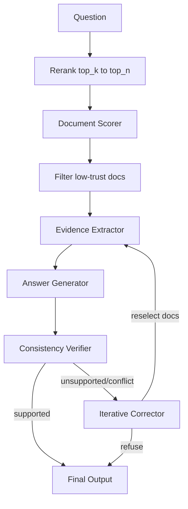

# EGI-RAG 系统框架图

```mermaid
flowchart TD
    Q[Question] --> R[Rerank top_k to top_n]
    R --> DS[Document Scorer]
    DS --> F[Filter low-trust docs]
    F --> EE[Evidence Extractor]
    EE --> AG[Answer Generator]
    AG --> CV[Consistency Verifier]
    CV -->|supported| OUT[Final Output]
    CV -->|unsupported/conflict| IC[Iterative Corrector]
    IC -->|reselect docs| EE
    IC -->|refuse| OUT
```

## 输出字段

- `answer`: 最终答案
- `selected_doc_ids`: 采用的文档
- `evidence_spans`: 证据句
- `doc_scores`: 文档评分
- `verification_result`: 校验结果
- `iteration_log`: 每轮迭代记录
