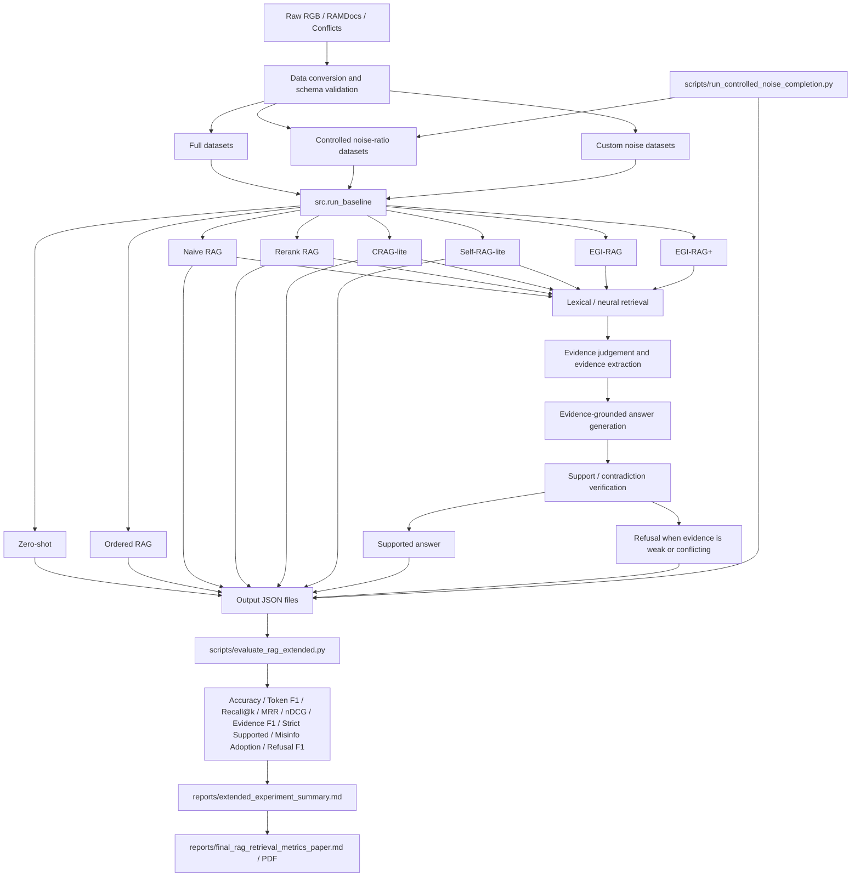

# Overall RAG Experiment Architecture

本图用于说明当前仓库从数据构造、方法运行到多维评估和论文报告的整体结构。`reports/egi_rag_framework.md` 更偏 EGI-RAG 内部流程；本文件偏项目总架构。

## EGI-RAG+ 效果变差的原因

EGI-RAG+ 的目标不是单纯提高 Answer Accuracy，而是把误导采纳风险压低。当前全量结果中，EGI-RAG+ 在 RAMDocs 上将 Misinfo Adoption Rate 从 EGI-RAG 的 `0.1100` 降到 `0.0080`，说明冲突识别和保守拒答确实生效；但 Answer Accuracy 从 `0.5320` 降到 `0.2260`，说明策略过于保守。

主要问题是当前 EGI-RAG+ 对 `misleading / contradictory` 的惩罚太硬：只要出现冲突或误导证据，且 supportive 证据不够强，就倾向拒答。这会减少错误答案，但也会把一部分本来可以回答的样本误拒答。因此论文里应把它表述为“风险控制型改进”，而不是“整体准确率改进”。

更合理的后续版本可以改成软阈值：

- 只有当 contradictory 文档数量超过 supportive 文档数量时拒答。
- 只有 verifier 明确判定答案与 evidence 冲突时拒答。
- 对 supportive 证据数量、证据覆盖率和冲突强度加权，而不是遇到冲突就直接拒答。
- 增加 LLM judge 或人工复核，避免字符串评估把语义正确答案误判为错误。
